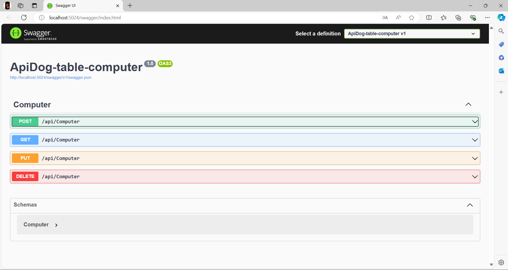
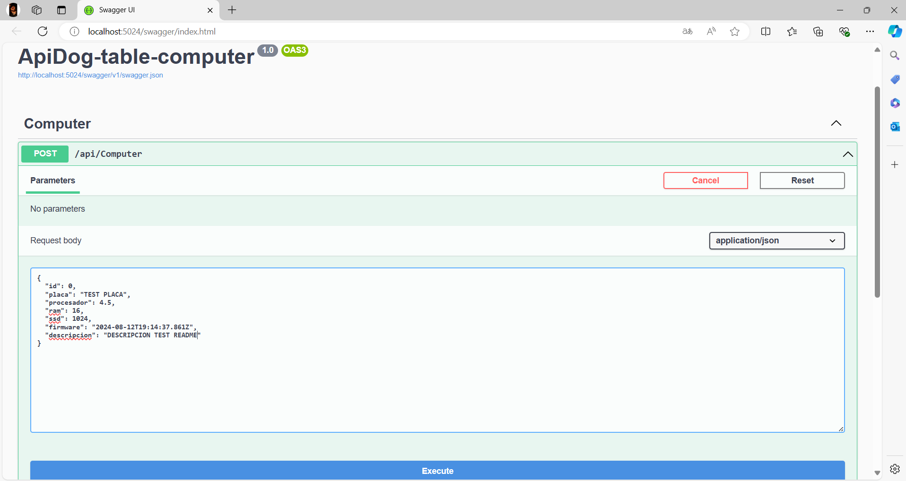
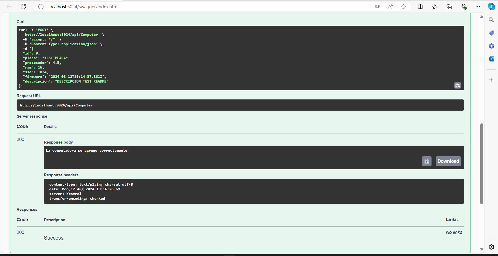
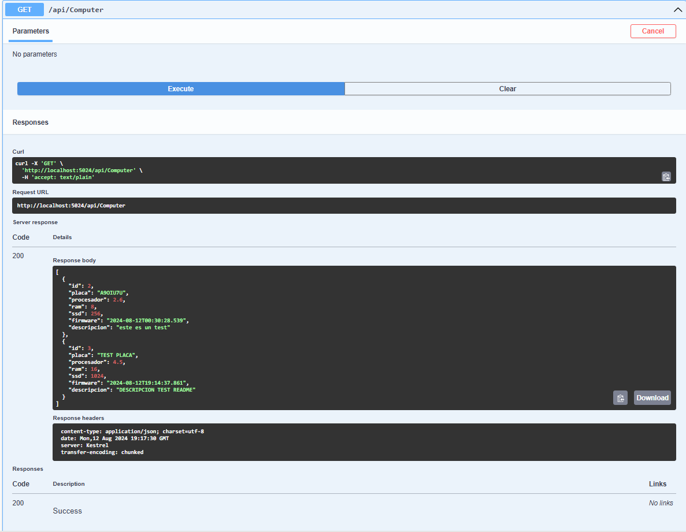
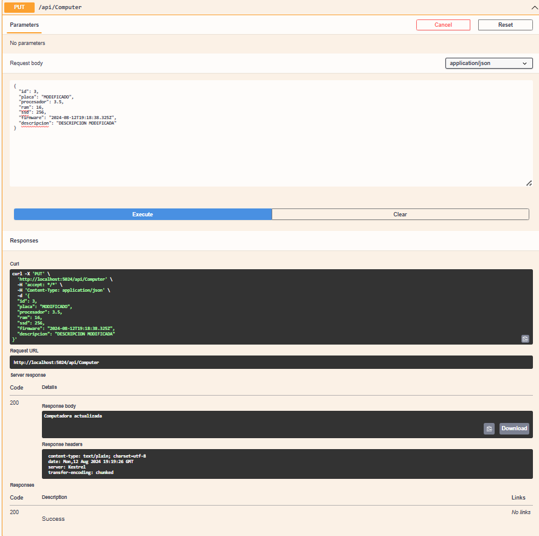
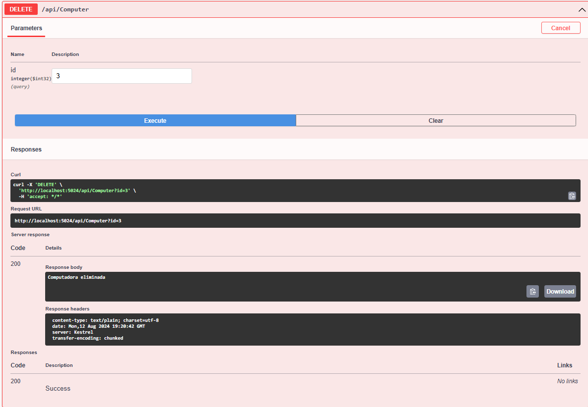

# ApiDog Table Computer

## Descripción

ApiDog
Esta es una practica de WEB API con una sola tabla en sql server

## Características

- POST
- GET
- PUT
- DELETE

## Requisitos

- [C#]
- [VISUAL STUDIO 2022]
- [NuGets]
- [EntityFrameworkCore]
- [EntityFrameworkCore.SqlServer]
- [EntityFrameworkCore.Tools]

## Capturas
### SWAGER

### POST

### GET

### PUT

### DELETE

